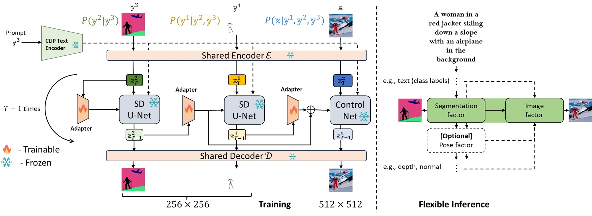

# FG-DM
[**Adapting Diffusion Models for Improved Prompt Compliance and Controllable Image Synthesis**](https://github.com/DeepakSridhar/fgdm)<br/>
[Deepak Sridhar](https://deepaksridhar.github.io/),
[Abhishek Peri](https://github.com/abhishek-peri),
[Rohith Rachala](https://github.com/rohithreddy0087)\,
[Nuno Vasconcelos](http://www.svcl.ucsd.edu/~nuno/)<br/>
_[NeurIPS '24](https://deepaksridhar.github.io/factorgraphdiffusion.github.io/static/images/FG_DM_NeurIPS_2024_final.pdf) |
[GitHub](https://github.com/DeepakSridhar/fgdm) | [arXiv](https://arxiv.org/abs/2410.21638) | [Project page](https://deepaksridhar.github.io/factorgraphdiffusion.github.io)_



  
## Requirements
A suitable [conda](https://conda.io/) environment named `ldm` can be created
and activated with:

```
conda env create -f fgdm.yaml
conda activate ldm
```


## FG-DM Weights


Coming soon!


- We used sdv1.4 weights for training FG-DM conditions but sdv1.5 is also compatible:

- The original SD weights are available via [the CompVis organization at Hugging Face](https://huggingface.co/CompVis). The license terms are identical to the original weights.

- `sd-v1-4.ckpt`: Resumed from `sd-v1-2.ckpt`. 225k steps at resolution `512x512` on "laion-aesthetics v2 5+" and 10\% dropping of the text-conditioning to improve [classifier-free guidance sampling](https://arxiv.org/abs/2207.12598).

- Download the condition weights from [ControlNet](https://huggingface.co/lllyasviel/ControlNet/tree/main/annotator/ckpts) and place them in the models folder to train depth and normal FG-DMs. 

- Alternatively download all these models by running [download_models.sh](scripts/download_models.sh) file under scripts directory.

## Inference: Text-to-Image with FG-DM

```
bash run_inference.sh
```

## Training: FG-DM Seg
```
python main.py --base configs/stable-diffusion/nautilus_coco_adapter_semantic_map_gt_captions_distill_loss.yaml -t --gpus 0,
```

## Acknowledgements 

Our codebase for the diffusion models builds heavily on [LDM codebase](https://github.com/CompVis/latent-diffusion) and [ControlNet](https://github.com/lllyasviel/ControlNet).

Thanks for open-sourcing!


## BibTeX

```
@inproceedings{neuripssridhar24,
      author = {Sridhar, Deepak and Peri, Abhishek and Rachala, Rohit and Vasconcelos, Nuno},
      title = {Adapting Diffusion Models for Improved Prompt Compliance   and Controllable Image Synthesis},
      booktitle = {Neural Information Processing Systems},
      year = {2024},
  }
```


